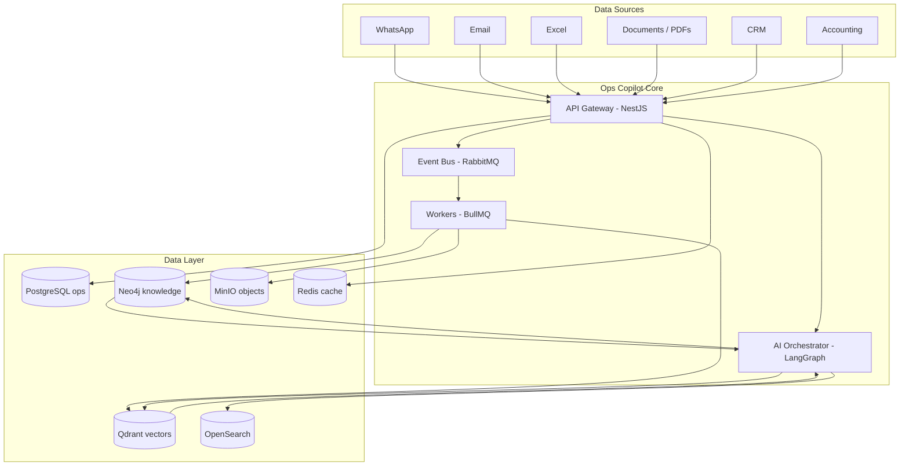
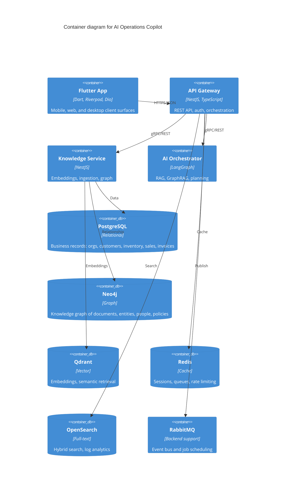

# Architecture

This document is the **entry point** for understanding the system architecture.
It links the deep-dive documentation. The authoritative specifications live in
[`docs/specifications/`](docs/specifications/) and decision records in
[`docs/architecture/adrs/`](docs/architecture/adrs/).

## System at a Glance

**AI Operations Copilot** is a multi-tenant, event-driven AI platform that helps
small and medium businesses automate back-office operations. It marries:

- **A relational core** (PostgreSQL) for the business of record.
- **A graph** (Neo4j) for knowledge relationships.
- **A vector store** (Qdrant) for semantic retrieval.
- **A full-text index** (OpenSearch) for hybrid search.
- **An AI layer** (LangGraph + provider-agnostic model gateway) for language work.
- **Work queues** (RabbitMQ / BullMQ) for asynchronous processing.
- **A Flutter client** for mobile/desktop/web surfaces.

### Logical Topology



## Container Diagram



> Full interactive server diagrams and the C4 model are in
> [docs/architecture/](docs/architecture/) and
> [docs/diagrams/](docs/diagrams/).

## Key Principles

- **Clean Architecture** — domain core, independent of framework/database/AI/vendor.
- **Documentation-first** — every change updates related docs in the same PR.
- **Event-driven** — async communication via RabbitMQ where synchronous
  responses are not required.
- **Security by default** — RBAC, tenancy isolation, secrets management,
  prompt-injection defenses.
- **Twelve-factor** — declarative config, disposable processes, no local state.

## Layers and Ownership in the Codebase

```
apps/backend           NestJS API, domains, infra adapters
apps/mobile            Flutter app (feature-first)
packages/shared        Shared TS contracts used by backend + docs
packages/ui            Design system (design tokens, components)
packages/config        Runtime configuration & validation
infrastructure/        Docker/Kubernetes/monitoring definitions
```

## Where To Go Next

| Context | Read |
| ------- | ---- |
| Understand the product | [`docs/specifications/PROJECT_SPEC.md`](docs/specifications/PROJECT_SPEC.md) |
| Deep architecture | [`docs/specifications/ARCHITECTURE_SPEC.md`](docs/specifications/ARCHITECTURE_SPEC.md) |
| Data & schema | [`docs/specifications/DATABASE_SPEC.md`](docs/specifications/DATABASE_SPEC.md) |
| AI / RAG / GraphRAG | [`docs/specifications/AI_ARCHITECTURE.md`](docs/specifications/AI_ARCHITECTURE.md) |
| APIs | [`docs/specifications/API_SPEC.md`](docs/specifications/API_SPEC.md) |
| Security | [`docs/specifications/SECURITY_SPEC.md`](docs/specifications/SECURITY_SPEC.md) |
| Operations | [`docs/specifications/DEVOPS_SPEC.md`](docs/specifications/DEVOPS_SPEC.md) |
| Why this stack | [`docs/architecture/adrs/`](docs/architecture/adrs/) |
| Delivery plan | [`ROADMAP.md`](ROADMAP.md) |