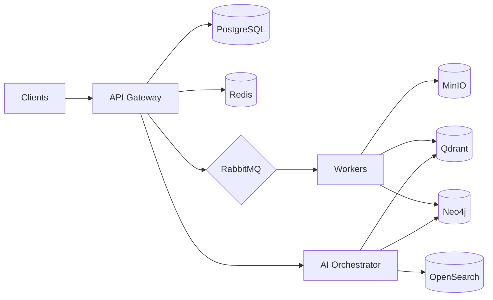

# Architecture

This directory is the home of the architecture documentation beyond the specifications and ADRs.

| Document                                                 | Purpose                                            |
| -------------------------------------------------------- | -------------------------------------------------- |
| [ADRs](./adrs/README.md)                                 | Decision records (ADR-0001..0013) + template       |
| [Specifications](../specifications/ARCHITECTURE_SPEC.md) | The full system-context, container, component view |

## High-level map

## Architecture principles (top level)

1. Clean Architecture — strict layers in `apps/backend`.
2. Documentation-first — each PR updates ADR/docs affected.
3. Event-driven communication across boundaries.
4. Security/tenancy asserted by default.
5. Observability is a first-class feature.
