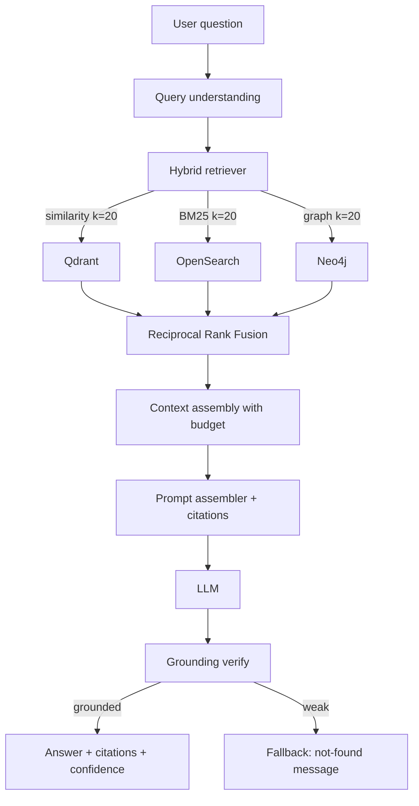

# AI Retrieval Flow

Hybrid retrieval pipeline used by the AI chat / question-answering endpoint.

```mermaid
flowchart TD
    Q[User question] --> U[Query understanding]
    U --> S[Hybrid retriever]
    S -->|similarity k=20| SD[Qdrant]
    S -->|BM25 k=20| KW[OpenSearch]
    S -->|graph k=20| GR[Neo4j]
    SD --> F[Reciprocal Rank Fusion]
    KW --> F
    GR --> F
    F --> C[Context assembly with budget]
    C --> P[Prompt assembler + citations]
    P --> L[LLM]
    L --> V[Grounding verify]
    V -->|grounded| A[Answer + citations + confidence]
    V -->|weak| D[Fallback: not-found message]
```

## Read more

- [AI architecture spec](../specifications/AI_ARCHITECTURE.md)