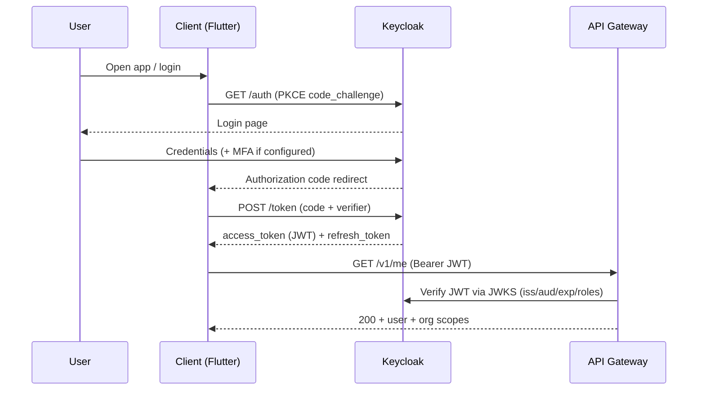

# Authentication Flow

OIDC Authorization Code + PKCE through Keycloak.

- Access token TTL: 15 min; refresh rotation (7 days).
- Refresh on 401 handled by Dio interceptor.
- Role claims (`org_id`, `org.role`) populate tenant context.

## Also see

- [SECURITY_SPEC](../specifications/SECURITY_SPEC.md)
- [Keycloak ADR](../architecture/adrs/ADR-0008-keycloak.md)
