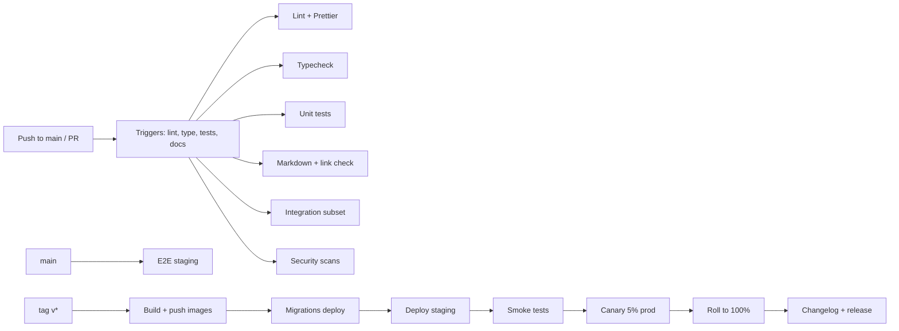

# CI/CD Pipeline

## Workflow → purpose

| File | Purpose |
| ---- | ------- |
| `.github/workflows/lint.yml` | ESLint, Prettier, commitlint |
| `.github/workflows/build.yml` | Backend & Flutter build matrix |
| `.github/workflows/docs.yml` | Markdown lint + link validator + Mermaid syntax check |
| `.github/workflows/security-scan.yml` | Semgrep, gitleaks, dep audit, Trivy |
| `.github/workflows/release.yml` | Tag-driven build + migration + deploy + notes |

## Read more

- [DEVOPS_SPEC](../specifications/DEVOPS_SPEC.md)