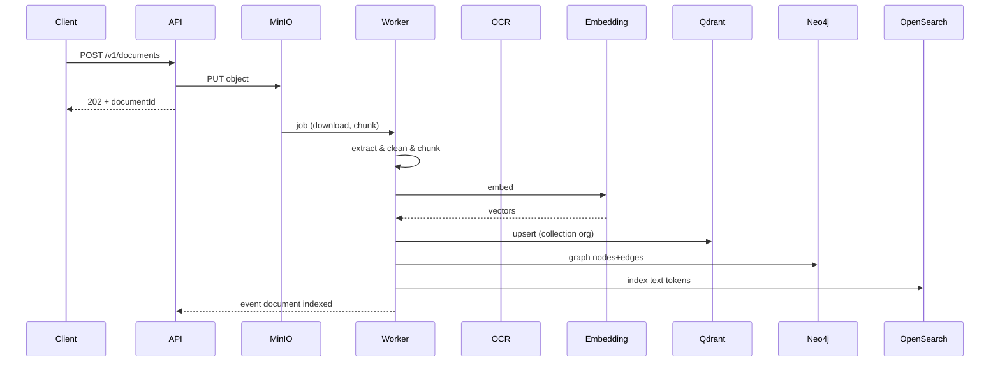
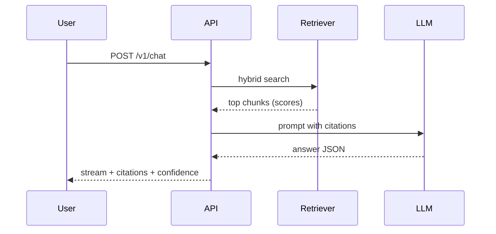
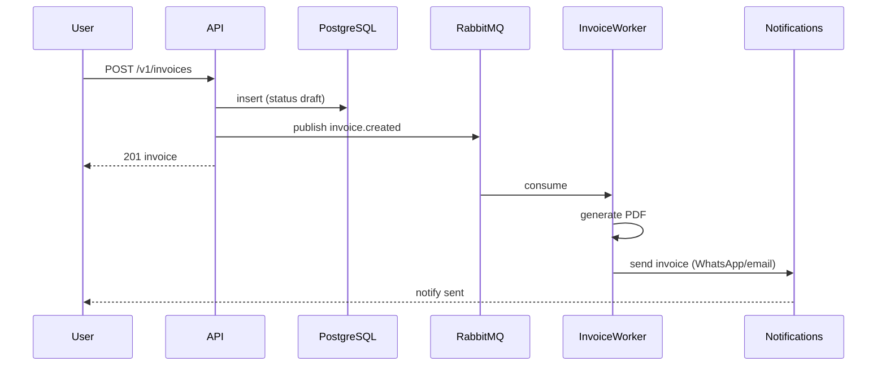

# Data Flow Diagrams

## 1. Upload document → Searchable

```mermaid
sequenceDiagram
    participant U as Client
    participant A as API
    participant M as MinIO
    participant W as Worker
    participant O as OCR
    participant E as Embedding
    participant V as Qdrant
    participant G as Neo4j
    participant S as OpenSearch

    U->>A: POST /v1/documents
    A->>M: PUT object
    A-->>U: 202 + documentId
    M->>W: job (download, chunk)
    W->>W: extract & clean & chunk
    W->>E: embed
    E-->>W: vectors
    W->>V: upsert (collection org)
    W->>G: graph nodes+edges
    W->>S: index text tokens
    W-->>A: event document indexed
```

## 2. Chat Q&A (RAG)

```mermaid
sequenceDiagram
    participant U as User
    participant A as API
    participant F as Retriever
    participant L as LLM
    U->>A: POST /v1/chat
    A->>F: hybrid search
    F-->>A: top chunks (scores)
    A->>L: prompt with citations
    L-->>A: answer JSON
    A-->>U: stream + citations + confidence
```

## 3. Invoice workflow

```mermaid
sequenceDiagram
    participant U as User
    participant A as API
    participant DB as PostgreSQL
    participant Q as RabbitMQ
    participant W as InvoiceWorker
    participant N as Notifications

    U->>A: POST /v1/invoices
    A->>DB: insert (status draft)
    A->>Q: publish invoice.created
    A-->>U: 201 invoice
    Q->>W: consume
    W->>W: generate PDF
    W->>N: send invoice (WhatsApp/email)
    N-->>U: notify sent
```
