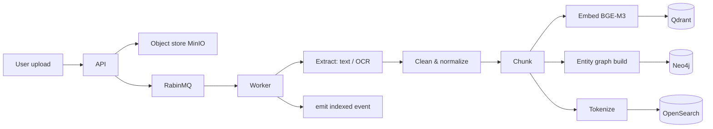

# Knowledge Ingestion Flow

From raw upload to searchable, indexed knowledge.

## Read more

- [DATABASE_SPEC](../specifications/DATABASE_SPEC.md)
- [AI_ARCHITECTURE](../specifications/AI_ARCHITECTURE.md)