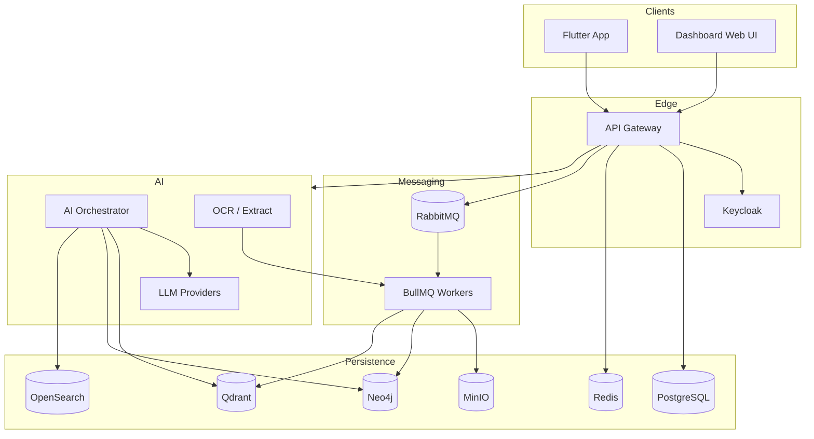

# System Architecture Diagram

Full system context and container diagram for the AI Operations Copilot.

## Container Responsibilities

| Container                   | Responsibility                        |
| --------------------------- | ------------------------------------- |
| API Gateway                 | REST, auth, validation, orchestration |
| AI Orchestrator (LangGraph) | RAG, tool-calling, planning           |
| Knowledge Worker            | ingestion, embeddings, graph building |
| PostgreSQL                  | system of record (ACID)               |
| Neo4j                       | knowledge relationships               |
| Qdrant                      | vectors / embeddings                  |
| OpenSearch                  | full text + hybrid index              |
| MinIO                       | object storage (docs, exports)        |
| Redis                       | cache, sessions, queues, rate-limit   |

## Read more

- [Architecture spec](../specifications/ARCHITECTURE_SPEC.md)
- [ADR-0010 Kubernetes](../architecture/adrs/ADR-0010-kubernetes.md)
