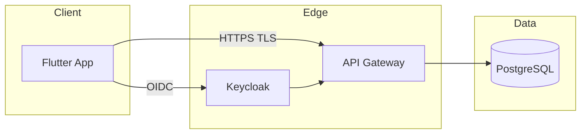

# Authentication & Authorization Flows

Companion to [SECURITY_SPEC](../specifications/SECURITY_SPEC.md).

## Trust boundaries

## JWT validation

- Algorithm: RS256 (Keycloak JWKS).
- Checks: signature, `iss`, `aud`, `exp`, `nbf`, and claims `org_id`, `role`.
- Token refresh: on `401`, refresh via `/auth/refresh`; retry once.

## Tenancy

- `org_id` claim drives all database queries (row-level + app-layer checks).
- No cross-org data reachable without RBAC role.

## Also see

- [SECURITY_SPEC](../specifications/SECURITY_SPEC.md)
- [authentication-flow diagram](../diagrams/authentication-flow.md)
