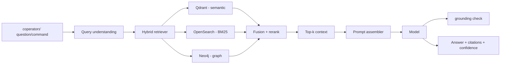
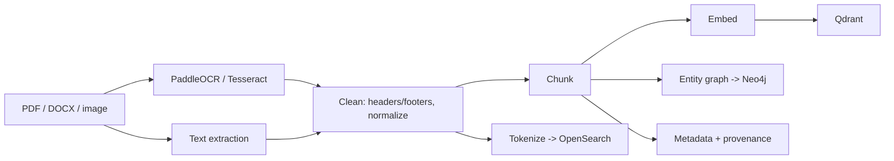

# AI Architecture

> Retrieval-Augmented Generation (RAG) · GraphRAG · evaluation · model routing

Status: **Draft · v0** · Owner: Carlos05-code

## 1. Purpose & Principles

The AI layer is a **grounded, copilot-grade** system. Four principles govern it:

1. **Ground everything in business data** (documents, conversations, invoices, commitments). No
   free-floating answers.
2. **Cite and be uncertain** — answers expose evidence and confidence.
3. **Contain prompts & leaks** — prompt injection defenses and tenancy isolation.
4. **Predictable economics** — route models by task, cache aggressively, and set hard cost ceilings
   per org.

## 2. Retrieval Workload Orbits



## 3. Embeddings

- Primary: **BAAI BGE-M3** (multi-lingual, dense + sparse), dimension 1024.
- Fallback: `text-embedding-3-large` (OpenAI) when on-network model is unavailable.
- The embedding service is a **port** — provider swappable
- Vector index: Cosine distance; normalization before upsert for BGE-M3.

## 4. Chunking & Ingestion pipelести

> Status (Phase 2): ingestion, embeddings, keyword indexing, and graph indexing are shipped
> (register → MinIO → extract → clean → chunk → embed → Qdrant `doc_chunks_{org}` →
> `document.embedded` event; chunk → OpenSearch `search_{org}` via the `search-jobs` worker →
> `document.indexed` event; chunk + entities → Neo4j via the `graph-jobs` worker →
> `document.graph_indexed` event). The chunker targets 384 tokens with 64-token overlap and never
> splits mid-sentence. Entity extraction is deterministic (regex, LLM-free) for now. Scanned-PDF OCR
> and DOCX extraction are deferred (`UNSUPPORTED_DOCUMENT` 422 today).



Chunking rules:

- Target 256–512 tokens with 64-token overlap (configurable per collection).
- Never split mid-sentence/value; tables kept intact when in the same area.
- Segmenter: hierarchical (document → section → paragraph) for structure.

## 5. Retrieval Strategy (Hybrid + GraphRAG)

> Status: `POST /api/v1/search` implements steps 1–4 today: top-20 candidates per configured store
> (Qdrant vector + OpenSearch BM25 + Neo4j graph expansion from query entities), fused by RRF
> (k=60), degraded gracefully when a store is unconfigured/unavailable. Reranking (step 5) is
> planned.

Pipeline (with the retriever):

1. **Semantic** — top-k from Qdrant (vector similarity, k=20).
2. **Keyword** — BM25 via OpenSearch (k=20).
3. **Graph** — from entities detected, expand 1–2 hops in neo4j to boost the candidate set (k=20).
4. **Fusion** — Reciprocal Rank Fusion of the three lists; cap context to token budget (~8–12k
   tokens in domain).
5. **Rerank** — optional cross-encoder/LLM rerank for cues; default deterministic fusion for cost.
6. **Provenance** — every selected chunk links to source doc + chunk id + page.

Config: `AI_RAG_TOP_K`, `AI_CONTEXT_BUDGET_TOKENS`, etc. (see `configs/`).

## 6. Prompt Strategy

- Prompts are **modular and versioned**: system prompt, tool/anchor prompts, and a per-capability
  prompt. Stored in `packages/config/prompts` with a version.
- Every prompt contains a **system boundary**: knowledge base, tenancy clues, refusal behavior,
  citation format.
- **Structured answer contract**: the LLM returns JSON `{answer, citations[], confidence}`.
- Messages use tagged citations `[source:doc:chunk]`.

### 6.1 Prompt templates (foundation)

| Prompt                   | Purpose                          |
| ------------------------ | -------------------------------- |
| `qa.document`            | grounded Q&A over a document set |
| `summarize.conversation` | conversation summary             |
| `plan.tasks`             | task planning from signals       |
| `insight.executive`      | executive daily briefing         |
| `recommend.reorder`      | purchase recommendation          |
| `extract.entities`       | entity extraction for graph      |
| `safety.refusal`         | out-of-policy refusal            |

## 7. Context window & budgets

| Model tier     | Context budget                  |
| -------------- | ------------------------------- |
| Fast chat      | 4–6k tokens in prompt; streamed |
| Deep reasoning | 8–12k tokens; more for analysis |

- Token budget enforced _before_ sending prompt; trunces for the tail with per-chunk degradation
  warnings.
- Agentic loops for planning; single-shot for deterministic Q&A.

## 8. Citation & Answer contract

Every AI answer returns:

```json
{
  "answer": "...",
  "citations": [{ "document_id": "...", "chunk_id": "...", "page": 42, "score": 0.93 }],
  "confidence": 0.87,
  "grounded": true,
  "synthesis": "direct | derived | fallback"
}
```

- **grounded** is computed via entailment/rouge-l relevance check; if below threshold, surface a
  disclaimer and mark `synthesis: fallback`.
- **confidence** calibrated on human labels per release (see §11).

## 9. Hallucination Mitigation

1. Retrieval quality gating — if top-1 score below threshold, say "not in your data".
2. Constrained generation with citations and JSON schema.
3. Grounding verification pass (LLM-as-judge on entailment; deterministic first) — flaps between
   "verify" and "answer".
4. Human feedback loop: thumbs up/down stored as eval sets.

## 10. Confidence Scoring

- combine: retrieval score distribution, reranking margin, model self-reported uncertainty
  (entropy/logprob), keyword overlap with top sources.
- Output as a single float calibrated on eval set (Platt scaling planned).

## 11. AI Evaluation

Two feedback loops:

1. **Offline evaluation** (CI batch) — `tests/ai` fixtures of queries + gold answers per capability;
   metrics:

- Faithfulness (answer vs context)
- Answer relevance vs query
- Context precision/recall
- Citation precision/accuracy
- Latency + token cost

2. **Online signals** — sparkline thumbs, split-test streaming, escalation to fallback model when
   confidence low.

Release gate: new policy components drift must be < acceptable delta; otherwise blocked the merge.
`AI Evaluation` is a first-class CI stage (`.github/workflows/ai-eval.yml`).

## 12. Fallback Models

| Tier      | Primary        | Fallback               | When               |
| --------- | -------------- | ---------------------- | ------------------ |
| Fast chat | gpt-4o-mini    | gemini-1.5-flash       | outage/quota       |
| Deep QA   | gpt-4o         | claude-sonnet          | cost/latency spike |
| Embed     | BGE-M3 locally | text-embedding-3-large | degraded           |

Fallbacks are **non-interactive and quiet**: degrade gracefully and tag the answer
`synthesis: fallback`.

## 13. Model Routing

Rules evaluated every call (in the model gateway):

1. Org plan: free/basic/premium → tier map.
2. Intent: chat vs deep analysis vs summarize → tier.
3. Latency budget (fast front-roads) → model selection.
4. Token budget constraints.
5. If fallback needed/exceptional, route to next tier.

```ts
interface ModelRoute {
  provider: 'openai' | 'anthropic' | 'gemini';
  model: string;
  maxTokens: number;
  costTier: 'fast' | 'standard' | 'premium';
}
```

## 14. Guardrails

- Prompt injection: don't execute embedded instructions; mark untrusted content (documents, OCR) as
  <untrusted> in the prompt.
- PII handling: redaction policy in [SECURITY_SPEC](./SECURITY_SPEC.md); content filter for chat.
- Output limits: no financial decision output unless confidence + human step.
- Moderation: block/net lists; reporting.
- AI safety for autonomous tasks: human-in-the-loop gate on risk levels above a configured
  threshold.

## 15. Related Documents

- [PROJECT_SPEC](./PROJECT_SPEC.md) — capability
- [DATABASE_SPEC](./DATABASE_SPEC.md) — vector/graph stores
- [SECURITY_SPEC](./SECURITY_SPEC.md) — prompt injection defense
- ADRs: RAG graph decision in [ADR-0005](../architecture/adrs/ADR-0005-neo4j.md)
