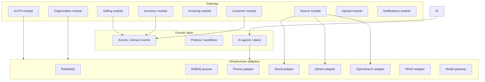
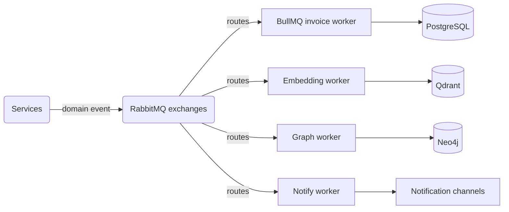
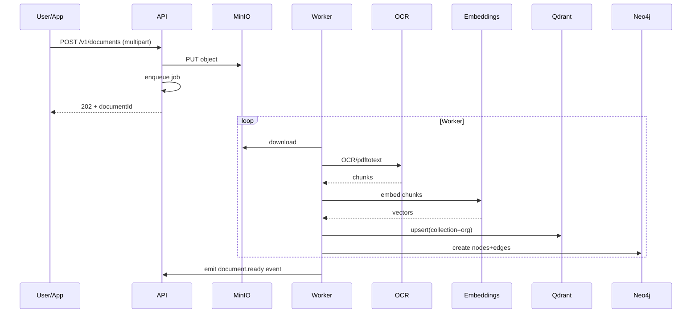
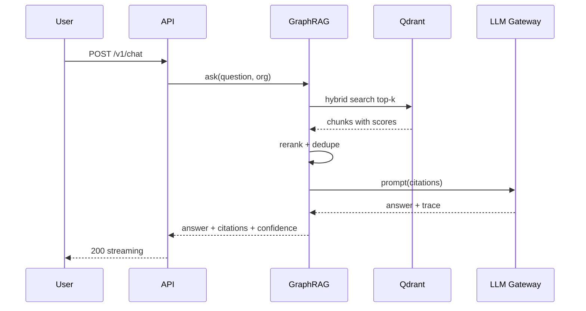

# Architecture Specification

> System context, containers, components, and the guiding architectural rules.

Status: **Draft · v0** · Related: [ADRs](../architecture/adrs/README.md)

## 1. Purpose

This document is the architectural contract for the AI Operations Copilot platform. Every component
in the repository must conform to the rules here unless a decision record supersedes one.

## 2. System Context

```mermaid
C4Context
title System Context — AI Operations Copilot for SMBs

Person(owner, "SMB Owner", "Runs the business; sees numbers and tasks")
Person(staff, "Ops Staff", "Handles daily operations")
Person(customer, "Customer", "Contacts the business via WhatsApp/email")

System(copilot, "AI Operations Copilot", "Virtual ops manager: centralizes data, automates workflows, answers questions")

System_Ext(wa, "WhatsApp Business", "Messaging")
System_Ext(email, "Email Provider", "Mailboxes")
System_Ext(erp, "POS / ERP / Accounting", "Business of record")
System_Ext(ai, "LLM Providers", "OpenAI / Anthropic / Gemini")
System_Ext(bank, "Bank / PSP", "Payments")

Rel(owner, copilot, "Uses, monitors")
Rel(ops, copilot, "Operates, uploads")
Rel(customer, WhatsApp, "Chats")
Rel(customer, email, "Emails")
Rel(WhatsApp, copilot, "Messages")
Rel(email, copilot, "Fetches")
Rel(copilot, accounting, "Syncs")
Rel(copilot, ai, "Generates answers")
Rel(copilot, bank, "Reconciles")
```

## 3. Container Diagram

```mermaid
C4Container
title Container diagram — AI Operations Copilot

Container(webapp, "Flutter App", "Dart, Riverpod", "Mobile, web, desktop")
Container(dashboard, "Web Dashboard", "React, Recharts", "Admin & analytics UI (future)")
ContainerB(api, "API Gateway", "NestJS", "REST, auth, orchestration, OpenAPI")
Container(kb, "Knowledge Service", "NestJS, LangGraph", "ingestion, embeddings, RAG")
Container(ai, "AI Orchestrator", "LangGraph", "planning, Q&A, workflows")
Container(wk, "Workers", "BullMQ", "async jobs, OCR, indexing")
ContainerDb(pg, "PostgreSQL", "Postgres", "operational data")
ContainerDb(neo, "Neo4j", "Graph", "knowledge graph")
ContainerDb(vec, "Qdrant", "Vector", "embeddings")
ContainerDb(os, "OpenSearch", "Full-text", "search index")
ContainerDb(redis, "Redis", "Cache + queues", "sessions, jobs, cache")
ContainerDb(minio, "MinIO", "S3-compatible", "documents, exports")

Rel(webapp, api, "HTTPS JSON")
Rel(dashboard, api, "HTTPS JSON")
Rel(api, kb, "REST")
Rel(api, ai, "REST/gRPC")
Rel(api, wk, "enqueue jobs")
Rel(kb, pg, "SQL")
Rel(kb, neo, "Cypher")
Rel(kb, vec, "Vector operations")
Rel(api, os, "Search")
Rel(api, redis, "Cache/lock")
Rel(kb, minio, "Object store")
Rel(ai, vec, "query vectors")
Rel(ai, os, "hybrid search")
```

## 4. Component (Module) Diagram — Backend



## 5. Clean Architecture & Hexagonal

The codebase is organized in **three concentric layers** inside `apps/backend`:

```
src/
├── app/                    # composition root, DI, wiring
├── modules/                # feature modules (feature-first)
│   └── <feature>/
│       ├── domain/         # entities, value objects, policies (pure TS)
│       ├── application/    # use-cases, ports (interfaces), commands/queries
│       ├── infrastructure/ # adapters: prisma, http, queues, ai
│       ├── presentation/   # controllers, dto, openapi
│       └── test/          # unit + integration tests
├── shared/                 # cross-cutting (errors, ids, tenancy, metrics)
└── main.ts                 # bootstrap
```

### Dependency Rules

1. Dependencies always point **inward**: presentation → application → domain.
2. `domain/` has **zero** dependencies on frameworks, ORM, or transport.
3. `application/` depends on `domain/` and **ports** only.
4. `infrastructure/` implements ports; nothing else imports it directly.
5. No circular module imports.

### Cross-cutting concerns

- Tenancy (org context) is resolved once per request and threaded via a scoped context object,
  required by every query/service.
- Correlation ID is created at edge and flows through logs, traces, and events.
- All LLM calls go through the **model gateway** port (fallback/route logic).
- Repository pattern for persistence; Unit of Work for transactional boundaries.

## 6. Microservice Readiness

Monolith deployed as **modular monolith first** (single deployable) with a strict module boundary
that can split later. Decision: ADR-0001 (monorepo), ADR-0003 (NestJS). Ready-to-split criteria:

- No cross-module direct feature-feature calls; only events or application API.
- Modules expose explicit internal API surface.
- Shared state only via its own microservice.

## 7. Event-Driven Design

- **Events** (facts, past tense): `invoice.created`, `stock_below_threshold`,
  `customer_message.received`.
- **Commands** (intent): `sendInvoice`, `scheduleFollowUp`, `reorderItem`.
- Event bus: RabbitMQ (fanout/exchange routing) + in-process bus for same-module events.
- Eventual consistency: read models (indexes, caches, graph, vector) updated asynchronously by
  workers.



## 8. Request / data flows

### 7.1 Upload document → knowledge



### 7.2 AI chat (RAG)



## 8. Non-Functional Architecture notes

- **Stateless API** — all state in PostgreSQL/Redis.
- **Horizontal scaling** — workers scale independently by queue.
- **Async wherever reasonable**: ingestion and AI generation are fully async, streaming on response.
- Every outbound service (LLM, E-mail, WhatsApp) is behind a port with retries/ fallback and circuit
  breaking where relevant.

## 9. Constraints & assumptions

- Multi-tenant single database by default (row-level tenant column + RBAC). ADR-0002 covers
  rationale.
- LLM cost and latency budget controlled via model routing (ADR in AI_ARCHITECTURE.md).
- SQL / Cypher are amenities of the underlying DB; abstracts are minimal by design — we do not wrap
  everything in a generic ORM (YAGNI) — Prisma + drivers only.
