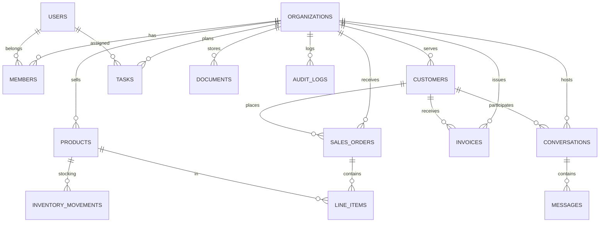
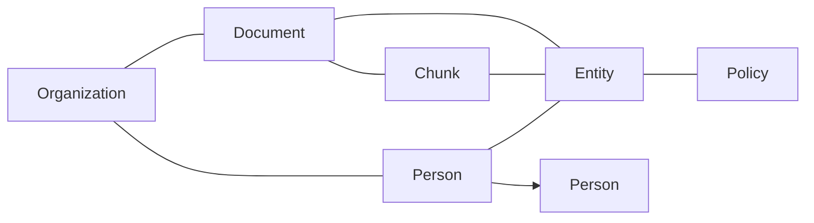

# Database Specification

> PostgreSQL · Neo4j · Qdrant · Redis · OpenSearch

Status: **Draft · v0** · Owner: Carlos05-code

## 1. Overview

The platform uses a **polyglot persistence** model. Each store owns a well-defined responsibility
(see [ADR-0004](../architecture/adrs/ADR-0004-postgresql.md),
[ADR-0005](../architecture/adrs/ADR-0005-neo4j.md),
[ADR-0006](../architecture/adrs/ADR-0006-qdrant.md),
[ADR-0013](../architecture/adrs/ADR-0013-redis.md)).

| Store      | Responsibility                                           | Consistency model                  |
| ---------- | -------------------------------------------------------- | ---------------------------------- |
| PostgreSQL | System of record; transactions; relational business data | Strong (ACID)                      |
| Neo4j      | Knowledge graph relationships; expertise & documents     | Eventual (write-through)           |
| Qdrant     | Vector embeddings and semantic retrieval                 | Eventual                           |
| OpenSearch | Full-text + hybrid search index                          | Eventual                           |
| Redis      | Cache, sessions, queues (BullMQ), rate limiting          | Eventually consistent at cache TTL |

## 2. Naming Conventions

- Tables: **snake_case**, plural. `invoices`, `line_items`, `organizations`.
- Columns: **snake_case**. `created_at`, `tenant_org_id`.
- PK: `id` (`uuid` by default).
- FK: `<table_singular>_id`. `organization_id`, `customer_id`.
- Index names: `idx_<table>_<column>`, unique: `uniq_<table>_<column>`.
- Enums: `pg_enum` for stable business enums; code-first via Prisma.

## 3. PostgreSQL Schema (v0 foundation)

Key entities (foundation only — see ROADMAP/ API_SPEC for the full boundary):

```
┌──────────────────┐      ┌──────────────────┐      ┌──────────────────┐
│ organizations    │      │ members          │      │ roles            │
│ id               │──────│ organization_id  │      └──────────────────┘
│ name, slug       │      │ user_id          │
│ tenant, plan     │      │ role (RBAC)      │
└──────────────────┘      └──────────────────┘

┌──────────────────┐      ┌──────────────────┐      ┌──────────────────┐
│ users            │      │ customers        │      │ products         │
│ id, email        │      │ organization_id  │      │ organization_id  │
│ auth_id          │      │ name, phone      │      │ name, sku, price │
│ active           │      │ channel fields   │      │ cost, stock      │
└──────────────────┘      └──────────────────┘      └──────────────────┘

┌──────────────────┐      ┌──────────────────┐      ┌──────────────────┐
│ sales_orders     │      │ invoices         │      │ inventory        │
│ organization_id  │      │ organization_id  │      │ product_id, ...  │
│ customer_id      │      │ customer_id      │      │ quantity_on_hand │
│ status, total    │      │ due_date, status │      │ (branch/warehouse)
└──────────────────┘      └──────────────────┘      └──────────────────┘

┌──────────────────┐      ┌──────────────────┐      ┌──────────────────┐
│ tasks            │      │ notifications    │      │ conversations    │
│ org_id, assignee │      │ org_id, user_id  │      │ org_id, channel  │
│ title, due_date  │      │ kind, payload    │      │ customer_id      │
│ status, priority │      │ read_at          │      │ external_id      │
└──────────────────┘      └──────────────────┘      └──────────────────┘

┌──────────────────┐
│ messages         │
│ conversation_id  │
│ sender, body     │
│ sent_at          │
└──────────────────┘
```

### 3.1 Core tables (foundation)

| Table                 | Purpose                                                                                                                                           |
| --------------------- | ------------------------------------------------------------------------------------------------------------------------------------------------- |
| `organizations`       | Tenant row; `slug` unique; plan/billing metadata                                                                                                  |
| `users`               | Identity; linked to Keycloak `auth_id`; interop                                                                                                   |
| `members`             | Org membership + role (RBAC)                                                                                                                      |
| `customers`           | Customers per org; channel handles (whatsapp)                                                                                                     |
| `products`            | SKUs, prices, cost, reorder point                                                                                                                 |
| `inventory_movements` | stock ledger (in/out)                                                                                                                             |
| `sales_orders`        | Orders (line items normalized)                                                                                                                    |
| `invoices`            | Invoice header + status flow                                                                                                                      |
| `invoice_items`       | line-level items + taxes                                                                                                                          |
| `tasks`               | AI-planned + human tasks, with agent metadata                                                                                                     |
| `documents`           | metadata about uploads; content in MinIO; status lifecycle `PENDING → PROCESSING → INDEXED / FAILED`; `clean_text_key` sidecar holds cleaned text |
| `knowledge_documents` | org-scoped KB entries (reference to the cleaned-text MinIO object)                                                                                |
| `notifications`       | notifications per user/org channel                                                                                                                |
| `conversations`       | customer conversation threads per org/channel (whatsapp/email/slack); `(organization_id, external_id)` unique for idempotent ingestion            |
| `messages`            | individual messages inside a conversation; sender (`CUSTOMER`/`AGENT`/`SYSTEM`); `(conversation_id, external_id)` unique for dedupe               |
| `audit_logs`          | audit events (compliance)                                                                                                                         |

### 3.2 ER Diagram (foundation)



## 4. Neo4j Graph Model

> Status: the core subgraph is implemented — `(:Document {id, org_id})`,
> `(:Chunk {id, document_id, org_id, index, text})`, and `(:Entity {canonical, org_id, kind})` with
> `HAS_CHUNK` / `CONTAINS` edges, written idempotently (MERGE) by the `graph-jobs` worker from a
> deterministic regex entity extractor (emails, URLs, acronyms, capitalized names — LLM-free;
> honorific-prefixed names become `person`). Retrieval expands 1 hop from query entities. `Person`,
> `Policy`, `Conversation`, `Task`, `RELATED_TO`/`EXPERT_IN` arrive with later units.

Purpose: model **knowledge** relationships that are expensive/impossible in SQL: documents ↔
entities ↔ people ↔ policies, and organizational expertise.

Core node types:

- `:Organization`, `:Person`, `:Document`, `:Chunk`, `:Entity`, `:Policy`, `:Customer`, `:Product`,
  `:Conversation`, `:Task`.

Key relationship types:

- `(:Person)-[:WORKS_AT]->(:Organization)`
- `(:Document)-[:BELONGS_TO]->(:Organization)`
- `(:Document)-[:HAS_CHUNK]->(:Chunk)`
- `(:Document)-[:MENTIONS]->(:Entity)`
- `(:Person)-[:EXPERT_IN]->(:Entity)`
- `(:Chunk)-[:CONTAINS]->(:Entity)`
- `(:Policy)-[:APPLIES_TO]->(:Entity)`
- `(:Person)-[:KNOWS]->(:Person)`
- `(:Task)-[:RELATED_TO]->(:Entity)`



Constraints: `UNIQUE` on `Organization.id`, `Person.id`, `Document.id`, `Entity.canonical` (per
org).

## 5. Qdrant Collections

> Status: `doc_chunks_{org}` and `conversation_{org}` are implemented — the embedding workers create
> collections on first use with Cosine distance and payload indexes (`org_id` + `source_document_id`
> / `conversation_id`), and upsert deterministic points (`sha1(documentId:index)` /
> `sha1(conversationId:messageId)`) for idempotent re-runs.

| Collection           | Vector size                | Distance | Payload                                                                          |
| -------------------- | -------------------------- | -------- | -------------------------------------------------------------------------------- |
| `doc_chunks_{org}`   | 1024 (EMBEDDING_DIMENSION) | Cosine   | source_document_id, org_id, page, text, chunk_id                                 |
| `conversation_{org}` | 1024                       | Cosine   | org_id, conversation_id, customer_id, channel, sender, message_id, sent_at, text |

Quotas: one collection per org (namespace pattern) to support tenancy and rewrite/deletion. Payload
indexed on `org_id` and `source_document_id`; `text` carries the full chunk text (≤ 4000 chars) so
vector-only retrieval can serve citations without a second store lookup.

## 6. Redis Usage

| Use                  | Key pattern                      |
| -------------------- | -------------------------------- |
| Cache                | `cache:{module}:{id}` (TTL)      |
| Rate limiting        | `rl:{route}:{userId}` window     |
| Session (optional)   | `sess:{token}`                   |
| BullMQ queue (Redis) | `bull:invoice-*`, `bull:embed-*` |
| Distributed locks    | `lock:{resource}` (NX)           |
| Idempotency keys     | `idem:{userId}:{action}`         |

## 7. Search Index (OpenSearch)

> Status: `search_{org}` is implemented — the search worker creates indices on first use with the
> chunk mappings below, bulk-indexes chunks with deterministic ids (`sha1(documentId:index)`), and
> retrieval happens through `POST /api/v1/search` (API_SPEC §11.5).

- One index per org: `search_{org}`.
- Fields indexed: `text` (analyzed), `org_id`, `source_document_id`, `chunk_id` (keyword), `page`.
- Hybrid retrieval pipeline combines:
  - BM25 from OpenSearch
  - vector similarity from Qdrant
  - graph proximity from Neo4j (planned)
- Ranking: RRF (Reciprocal Rank Fusion) merging (k=60, top-20 candidates per store), then rerank via
  LLM (optional, later).

## 8. Indexes & Constraints (PostgreSQL foundation)

```sql
-- Unique
UNIQUE (organizations.slug)
UNIQUE (users.email)
UNIQUE (members.organization_id, user_id)
UNIQUE (products.organization_id, sku)

-- Query indexes
CREATE INDEX idx_products_org ON products (organization_id);
CREATE INDEX idx_sales_org_created ON sales_orders (organization_id, created_at DESC);
CREATE INDEX idx_invoices_org_status ON invoices (organization_id, status);
CREATE INDEX idx_tasks_org_assignee ON tasks (organization_id, assignee_id) WHERE status != 'done';
CREATE INDEX idx_audit_org ON audit_logs (organization_id, created_at DESC);
```

> Indexes are a **first-class deliverable** per feature; every new query must run under `EXPLAIN`
> before merge.

## 9. Migration Strategy

- **Prisma migrations** are the single source of truth for PostgreSQL schema.
- Migration workflow: `prisma migrate dev` → review → `migrate deploy` (CI).
- Data migrations via Idempotent `prisma db execute --file` scripts.
- Multi-tenant care: `migrations` run in **no-downtime** mode on prod (expands), followed by
  backfills, followed by contract changes.

## 10. Process & Consistency

- No cross-entity long transactions; decompose into small units plus the outbox pattern (write to
  DB + enqueue event atomically via the outbox table).
- Graph, vector, and search indexes are **read models** built from the same events.

## 11. Security

- Row-level security recommended for direct query; always filter by `org_id` in application layer.
- Network isolation between tiers; TLS for all connections.
- Secrets (passwords, buckets) from `configs/` env — never hard-coded.
- Backups: WAL archiving + PITR (see [DEVOPS_SPEC](./DEVOPS_SPEC.md)).

## 12. Related Documents

- [Neo4j ADR](ADR-0005.md) · [Qdrant ADR](ADR-0006.md) · [Redis ADR](ADR-0013.md)
- [Data flow diagrams](../diagrams/data-flow.md)
