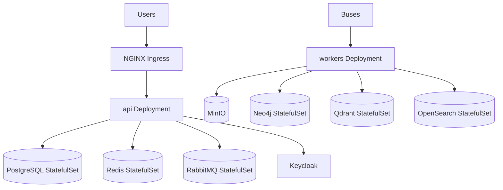

# DevOps Specification

Status: **Draft · v0** · Owner: Carlos05-code

## 1. Scope

How we ship: local Docker Compose → CI → Kubernetes → production posture, with observability,
backups, and recovery as core elements.

## 2. Docker & Compose (local dev)

- `docker-compose.yml` brings up all LAN services (see repository root).
- Compose profiles: `dev` (all), `monitoring` (prom/grafana/loki), `ai`.
- Secrets never in compose file; read via `configs/.env`.
- All images pinned to a digest or a patch-versioned tag.

## 3. Kubernetes deployment

> Status: shipped (`infrastructure/kubernetes/`) — Kustomize base + staging/production overlays,
> `api` **and** `worker` Deployments each with their own HPA (CPU/memory), NGINX Ingress +
> cert-manager, `NetworkPolicy`s restricting ingress to both, and a `prisma migrate deploy` Job.
> `worker` (`apps/backend/src/main-worker.ts`) runs the same `AppModule` with no HTTP adapter —
> every `@Processor` registers there too, as additional capacity alongside `api`'s own in-process
> processing, not a replacement for it (BullMQ consumers on one queue name are safe to run
> concurrently). Not a fully clean split: every feature module still bundles its controller and its
> workers in one module, so `worker` boots the whole graph rather than a worker-only subset — see
> `main-worker.ts`'s own header comment for why that's materially larger work. One remaining gap vs.
> the target below: the in-cluster StatefulSets for Postgres/Neo4j/Qdrant/OpenSearch/ MinIO/RabbitMQ
> are a staging convenience, not HA-backed production infrastructure (see
> `infrastructure/kubernetes/overlays/production/README.md`). RBAC here is minimal (a
> `ServiceAccount` per Deployment with `automountServiceAccountToken: false`, no in-cluster API
> access needed) rather than a fuller namespace-scoped Role/RoleBinding, since the app doesn't talk
> to the Kubernetes API.

- Manifest dir `infrastructure/kubernetes/`.
- App deployable as modular monolith + workers (HPA).
- Ingress: NGINX ingress controller; TLS via cert-manager.
- RBAC in-cluster for namespaces; network policies restrict egress/ingress.

## 4. CI/CD (GitHub Actions)

Workflows in `.github/workflows/`:

| Workflow            | Trigger            | Purpose                                       |
| ------------------- | ------------------ | --------------------------------------------- |
| `lint.yml`          | PR                 | ESLint, Prettier, Flutter analyze             |
| `build.yml`         | PR + merge         | API build, mobile build (matrix)              |
| `docs.yml`          | PR                 | Markdown lint + link check + Mermaid validate |
| `security-scan.yml` | PR + schedule      | Semgrep, gitleaks, dep audit, Trivy           |
| `db-migrate-check`  | PR touching prisma | validate migrations                           |
| `release.yml`       | tag v*             | build images, migrate, deploy, changelog      |

Pr release: all check workflows must be green; PR must pass `Definition of Done`.

## 5. Environments

| Env          | Purpose                                              | Provisioning        |
| ------------ | ---------------------------------------------------- | ------------------- |
| `dev`        | developers fix branch against shared infra (Compose) | local               |
| `staging`    | merged main, manual automation                       | K8s preview cluster |
| `production` | release candidate                                    | K8s prod clusters   |

- Promotion: only tagged releases move beyond staging.
- Feature flags: flags declared in `packages/config`, toggled per env.

## 6. Deployment strategy

- Rolling update with 2-replica minimum per service; `maxSurge: 1` `maxUnavailable: 0`.
- Zero-downtime migrations: expand → backfill → contract.
- Rollback: previous tag redeploy; DB migrations handled with `migrate deploy` forward-only;
  destructive changes gated behind feature flag or later release.

## 7. Scaling

- Stateless API/Nest pods scaled by HPA on CPU + RPS.
- Worker queues: HPA on queue depth (BullMQ).
- PostgreSQL: read replica for reads; unlogged for hot tables where safe.
- OpenSearch/Qdrant/Neo4j scale budgeted per org tokens (cost control).

## 8. Observability

> Status: traces + metrics + logs all shipped. `trace_id`/`req_id` log correlation
> (`pino-logger.service.ts`), and now Loki log shipping too — a second `pino` transport
> (`pino-loki`), gated behind `LOKI_URL` the same way tracing is gated behind
> `OTEL_EXPORTER_OTLP_ENDPOINT`. Pushed straight from the app over HTTP rather than a
> container-log-tailing agent, since the API runs on the host in local dev, not in a container a
> Promtail-style agent could see. Gap: only the API's own logs ship this way — the _other_
> containerized dependencies' logs (Postgres, Redis, etc.) aren't shipped anywhere
> (`infrastructure/monitoring/README.md`'s "Known gap").

- OpenTelemetry unified: traces + metrics + logs per service.
- Exporters: Prometheus (metrics, always on — a direct `GET /metrics` scrape, no collector
  required), Grafana (dashboards), Tempo (traces, via the otel-collector, gated behind
  `OTEL_EXPORTER_OTLP_ENDPOINT`), Loki (logs, gated behind `LOKI_URL`, pushed directly from the app
  — not through the otel-collector or a tailing agent).
- Default alerts (`infrastructure/monitoring/prometheus/alerting-rules.yml`):
  - SLO: API p95 latency > 800 ms, error rate > 1%, queue backlog pump alerts.
  - DB connections >= 70%, disk auto-scaling warnings — not yet implemented (no DB-level exporter).
- Correlation: `trace_id` + `req_id` in all logs.

## 9. Backup & recovery

> Status: shipped for 6 of 6 resources — nightly CronJobs (`infrastructure/kubernetes/base/backup/`)
> for PostgreSQL (`pg_dump`), Neo4j (APOC streaming export — unverified against a live cluster, see
> `infrastructure/devops/incident.md`'s "Known gaps"), Qdrant (per-collection snapshot), OpenSearch
> (S3-repository snapshot via the `repository-s3` plugin, off-cluster in the same
> `smb-copilot-backups` MinIO bucket every other backup uses — wired up and matching OpenSearch's
> own documented plugin/keystore setup, but **not yet exercised against a live cluster**), and MinIO
> (bucket versioning, a one-time Job). Redis relies on AOF + scheduled RDB already configured on its
> StatefulSet — no separate off-box backup job, since it holds no data this app treats as a system
> of record. PostgreSQL also gets continuous WAL archiving + a daily base backup via `wal-g`
> (`infrastructure/kubernetes/base/infrastructure/postgres.yaml`), giving it real point-in-time
> recovery instead of "since the last nightly dump" — wired up and matching wal-g's documented env
> vars/commands, but **not yet exercised against a live cluster** (no cluster was available while
> building it). The restore procedures and scenario playbooks the table below promises now exist at
> `infrastructure/devops/incident.md`, including a PITR procedure — none of this run end-to-end
> against a live cluster, so read its "Known gaps" section before trusting any of it in a real
> incident.

| Resource   | Strategy                                | RTO/RPO               |
| ---------- | --------------------------------------- | --------------------- |
| PostgreSQL | WAL archiving, PITR; nightly full dumps | RPO <= 5m, RTO <= 30m |
| Neo4j      | dump backups (per graph)                | RPO 1h, RTO 2h        |
| Qdrant     | snapshot per collection to object store | RPO 1h, RTO 2h        |
| OpenSearch | snapshot repository                     | RPO 1h, RTO 2h        |
| MinIO      | bucket replication / version history    | RPO 15m (continuous)  |
| Redis      | AOF + scheduled RDB                     | RPO 5m                |

- Disaster recovery: runbook `infrastructure/devops/incident.md` (DR) with failover to secondary
  region, restore-from-backups and validation checks.

## 10. Monitoring inventory

- Exporters/dashboards in `infrastructure/monitoring/`:
  - Prometheus scrape configs + `ServiceMonitor`.
  - Grafana dashboards JSON (API SLIs, workers, DB, queues).
  - Alerting rules (under `alerts/`).

## 11. Release process

1. Tag `vX.Y.Z` (semver, from CHANGELOG).
2. CI builds images, runs migrations in staging, runs smoke/e2e.
3. Manual approval gate in Actions for GA; blue-green switch.
4. On success: release notes appended; version bumped in `package.json`.

## 12. Related

- Terraform notes — stub, pending the IaC decision (no `infrastructure/` Terraform yet)
