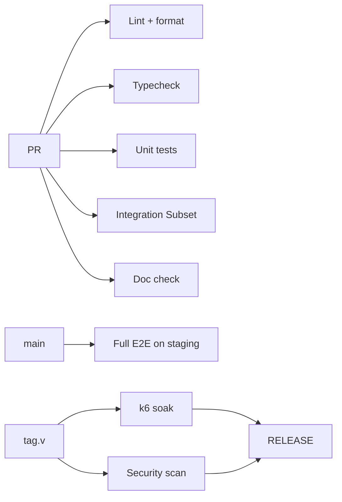

# Testing Specification

Status: **Draft · v0** · Owner: Carlos05-code

## 1. Test Pyramid

```
        E2E (few)
       /   \
     Integration
    (some)
      /
   Unit (many)
```

| Level            | Where              | Tooling                                 |
| ---------------- | ------------------ | --------------------------------------- |
| Unit (pure)      | domain/services    | Jest (TS), flutter_test (Dart)          |
| Integration      | DB/adapters        | Supertest + Jest, Prisma testcontainers |
| Widget (Flutter) | widgets            | flutter_test + widget_test              |
| E2E (API)        | `/tests`           | Supertest flows (Happy paths)           |
| E2E (Flutter)    | `integration_test` | integration_test package                |
| Load / PERF      | `/tests/load`      | k6                                      |
| Security         | `/tests/security`  | OWASP ZAP / Semgrep (see SECURITY)      |
| AI evaluation    | `tests/ai`         | pytest/test harness eval set            |

## 2. Unit Tests

- Pure domain logic without framework running.
- Use-cases tested against fake ports (never DB in unit tests).
- Coverage: 90% line (in `pnpm coverage`), statement coverage enforced in `jest.config`
  `coverageThreshold`.

## 3. Integration Tests

- Used for real adapter behavior (Prisma, Redis, MinIO, RabbitMQ).
- `testcontainers` spin ephemeral containers per test run — no shared mutable state.
- API integration flow: NestJS `supertest` against an app on ephemeral ports.

## 4. Widget Tests (Flutter)

- Wait for UI on golden/pixel tests for critical screens (set logic).
- `mocktail` for repositories; ProviderScope overrides.
- Golden files committed `test/goldens`; mismatch blocks.

## 5. E2E Tests

- API smoke on staging CI: auth → create org → invoice → search flow.
- Flutter `integration_test` against staged backend.

## 6. Performance / Load Tests (k6)

> Status: shipped (`tests/load/`) — smoke/soak/spike scripts sharing one weighted request mix
> against real API_SPEC endpoints, real Keycloak password-grant auth (per-VU cached, re-logs in near
> expiry, RBAC-aware — a VIEWER-assigned VU redirects `CreateInvoice` to a read action instead of
> hitting a real, correctly-enforced 403), thresholds matching the DEVOPS_SPEC §8 SLO alert numbers
> exactly. Wired into CI (`.github/workflows/release.yml`'s `load-test` job, gating `release` on
> every `v*` tag, matching §9's `tag.v --> LOAD[k6 soak]`) — boots the full stack as GitHub Actions
> `services:`, migrates, seeds, imports the Keycloak realm via its Admin REST API, builds and starts
> the API, then runs the real `k6 soak` scenario. Verified end-to-end, not just `k6 archive` syntax
> checking: a real 30-minute, 200-VU run passes at 100% (see `tests/load/README.md`'s "CI status").
> Building this surfaced several real, previously-unexercised bugs (Keycloak realm schema
> mismatches, a missing DI export, an invoice-numbering race) — see `CHANGELOG.md`.

- `tests/load/*.ts` scenarios:
  - `smoke`: 5 users · 1 min
  - `soak`: 200 users · 30 min
  - `spike`: up to 1k users
- Assertions: p95 < 800ms, error % < 1%.
- k6 dashboards: three envs output `grafana` dashboard — not built; k6's own summary output and
  optional `--out json=` trend files (`tests/load/results/`) are what exists today.

## 7. Security Tests

- Static: Semgrep + gitleaks on PR (github workflow).
- Dynamic: OWASP ZAP baseline in staging (nightly).
- Dependency: `pnpm audit` without failures gate on PR.
- API fuzzing targeted (persisted response schema contract).

## 8. Coverage Targets

| Layer        | Target                  |
| ------------ | ----------------------- |
| Backend core | ≥ 90%                   |
| Flutter      | ≥ 85%                   |
| AI eval set  | 100% pass (per release) |

## 9. CI Testing Pipeline



## 10. Reporting

- Coverage reports published to `coverage/` (html) + PR comment.
- k6 results stored as JSON for regression trend in `tests/load/results/`.
- API conformance snapshots (OpenAPI) under `docs/api/openapi.yaml`.
- All artifacts downloadable from CI summary.

## 11. Definition of "Test Completed"

A feature is only shipped when unit + integration + (if applicable) the capability E2E passes
locally AND in CI on the PR head, and performance targets are within monitored budget.

## 12. References

- [BACKEND_SPEC test section](./BACKEND_SPEC.md)
- [TESTING guide in CONTRIBUTING](../../CONTRIBUTING.md)
