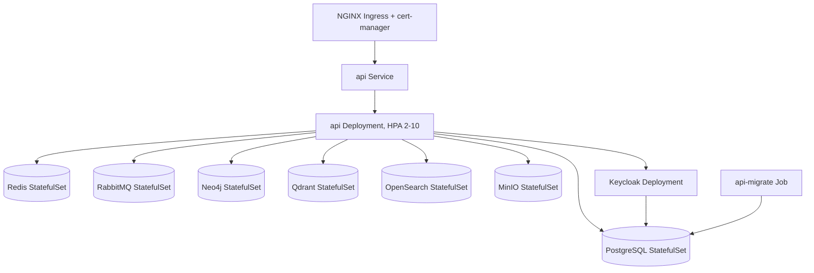

# Kubernetes

Production/staging manifests for the platform, managed with **Kustomize**. Built and validated with
`kustomize build` (v5.8.1) against every overlay — no live cluster was available to also run a
server-side `kubectl apply --dry-run`, so that step is still outstanding before a real rollout.

## Topology



There is **one** Deployment (`api`) — it serves HTTP and processes every BullMQ queue in-process,
because that's how `apps/backend/src/main.ts` actually boots today (every `@Processor` registers on
the same Nest app; there's no second, worker-only entrypoint). Scaling `api` scales both. A real
API/worker split needs a second bootstrap file with no HTTP listener first — tracked as a gap here,
same convention as the WhatsApp and Loki gaps in `ROADMAP.md`, not something faked with a duplicate
Deployment of the same image.

## Layout

```
kubernetes/
├── base/
│   ├── namespace.yaml
│   ├── backend/
│   │   ├── api-serviceaccount.yaml
│   │   ├── api-configmap.yaml        # non-secret env, mirrors .env.example
│   │   ├── api-secret.example.yaml   # TEMPLATE — documents required keys, never applied
│   │   ├── api-deployment.yaml       # HTTP + in-process BullMQ workers
│   │   ├── api-service.yaml
│   │   ├── api-hpa.yaml              # CPU/memory, 2-10 replicas
│   │   ├── api-ingress.yaml          # NGINX + cert-manager
│   │   ├── api-networkpolicy.yaml
│   │   └── migrate-job.yaml          # `prisma migrate deploy`, run before rollout
│   ├── infrastructure/               # StatefulSets: postgres, redis, rabbitmq,
│   │                                 # neo4j, qdrant, opensearch, minio
│   └── keycloak/                     # Deployment + realm-import ConfigMap
├── overlays/
│   ├── staging/     # 1 replica everywhere, :staging image tag, letsencrypt-staging
│   └── production/  # 3-15 replica API, :production image tag — see its README
│                     # for why the in-cluster StatefulSets aren't a real prod posture
└── README.md (this file)
```

## Applying

```
kustomize build infrastructure/kubernetes/overlays/staging   # or production
```

1. Build and push `infrastructure/docker/Dockerfile.api` tagged to match the overlay (`:staging` /
   `:production`).
2. Create the real `api-secret` out of band — see `base/backend/api-secret.example.yaml` for every
   key it needs. Never commit the filled-in version.
3. `kubectl apply -k infrastructure/kubernetes/overlays/<staging|production>`
4. Wait for the `api-migrate` Job to complete before traffic hits a new `api` rollout that added
   migrations:
   `kubectl wait --for=condition=complete job/api-migrate -n smb-copilot --timeout=120s`.

## Notes

- Secrets: intentionally no SealedSecrets/ESO dependency baked in here — the actual
  secret-management tool is an infra decision for whoever runs the cluster (see the production
  overlay's README); `api-secret.example.yaml` keeps the required-keys contract in one place
  regardless of which tool fills it.
- PVCs (`volumeClaimTemplates`) back every StatefulSet; no `StorageClass` is pinned, so whatever the
  cluster's default provides is used.
- HPA scales on CPU/memory only for now — a queue-depth-based HPA using the `queue_jobs_waiting`
  metric this app already exports needs a Prometheus Adapter or KEDA installed in-cluster first (not
  assumed to be there).

## See

- [DEVOPS_SPEC](../../docs/specifications/DEVOPS_SPEC.md)
- [ADR-0010](../../docs/architecture/adrs/ADR-0010-kubernetes.md)
