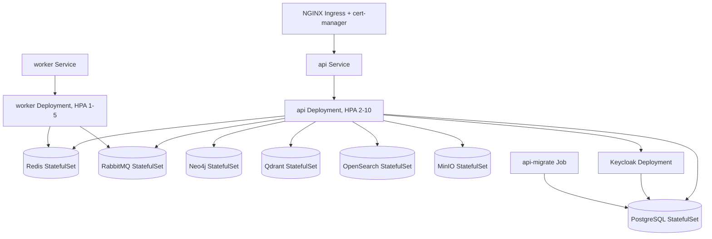

# Kubernetes

Production/staging manifests for the platform, managed with **Kustomize**. Built and validated with
`kustomize build` (v5.8.1) against every overlay — no live cluster was available to also run a
server-side `kubectl apply --dry-run`, so that step is still outstanding before a real rollout.

## Topology



There are **two** Deployments now: `api` (HTTP + in-process BullMQ processing) and `worker`
(`apps/backend/src/main-worker.ts` — no HTTP API, just the same `@Processor`s, plus a bare
`/metrics`+`/healthz` listener for Prometheus/kubelet). BullMQ consumers on the same queue name are
safe to run concurrently by design (Redis-backed per-job locking), so `worker` is _additional_
capacity, scalable independently of `api` — it doesn't replace `api`'s own processing. Both
Deployments run the exact same image and `AppModule`; only the container `command` differs.

**Still not a fully clean split**: every feature module bundles its HTTP controller and its workers
together (`task.module.ts` is typical — one module, one controller, two workers), so `worker`
bootstraps the whole module graph via `NestFactory.createApplicationContext` rather than a
worker-only subset — no REST routes get registered (no HTTP adapter is created at all), but the
controller classes still get instantiated as inert DI providers. Splitting every such module into
HTTP-only and worker-only halves is a materially larger change (BACKEND_SPEC-level module
restructuring) than this deployment split — not done here; see `main-worker.ts`'s own header
comment.

## Layout

```
kubernetes/
├── base/
│   ├── namespace.yaml
│   ├── backend/
│   │   ├── api-serviceaccount.yaml
│   │   ├── api-configmap.yaml         # non-secret env, mirrors .env.example
│   │   ├── api-secret.example.yaml    # TEMPLATE — documents required keys, never applied
│   │   ├── api-deployment.yaml        # HTTP + in-process BullMQ processing
│   │   ├── api-service.yaml
│   │   ├── api-hpa.yaml               # CPU/memory, 2-10 replicas
│   │   ├── api-ingress.yaml           # NGINX + cert-manager
│   │   ├── api-networkpolicy.yaml
│   │   ├── worker-serviceaccount.yaml
│   │   ├── worker-deployment.yaml     # same image, main-worker.js — no REST API
│   │   ├── worker-service.yaml        # /metrics + /healthz only, no Ingress
│   │   ├── worker-hpa.yaml            # CPU/memory, 1-5 replicas
│   │   ├── worker-networkpolicy.yaml
│   │   └── migrate-job.yaml           # `prisma migrate deploy`, run before rollout
│   ├── infrastructure/                # StatefulSets: postgres, redis, rabbitmq,
│   │                                  # neo4j, qdrant, opensearch, minio
│   └── keycloak/                      # Deployment + realm-import ConfigMap
├── overlays/
│   ├── staging/     # 1 api / 1 worker replica, :staging image tag, letsencrypt-staging
│   └── production/  # 3 api / 2 worker replicas, :production image tag — see its README
│                     # for why the in-cluster StatefulSets aren't a real prod posture
└── README.md (this file)
```

## Applying

```
kustomize build infrastructure/kubernetes/overlays/staging   # or production
```

1. Build and push `infrastructure/docker/Dockerfile.api` tagged to match the overlay (`:staging` /
   `:production`) — one image, both Deployments.
2. Create the real `api-secret` out of band — see `base/backend/api-secret.example.yaml` for every
   key it needs. Never commit the filled-in version.
3. `kubectl apply -k infrastructure/kubernetes/overlays/<staging|production>`
4. Wait for the `api-migrate` Job to complete before traffic hits a new rollout that added
   migrations:
   `kubectl wait --for=condition=complete job/api-migrate -n smb-copilot --timeout=120s`.

## Notes

- Secrets: intentionally no SealedSecrets/ESO dependency baked in here — the actual
  secret-management tool is an infra decision for whoever runs the cluster (see the production
  overlay's README); `api-secret.example.yaml` keeps the required-keys contract in one place
  regardless of which tool fills it.
- PVCs (`volumeClaimTemplates`) back every StatefulSet; no `StorageClass` is pinned, so whatever the
  cluster's default provides is used.
- HPA scales on CPU/memory only for now, for both `api` and `worker` — a queue-depth-based HPA using
  the `queue_jobs_waiting` metric this app already exports needs a Prometheus Adapter or KEDA
  installed in-cluster first (not assumed to be there); CPU is a weaker proxy for `worker`
  specifically, since a queue consumer can be CPU-idle while a backlog builds if it's waiting on an
  external call.

## See

- [DEVOPS_SPEC](../../docs/specifications/DEVOPS_SPEC.md)
- [ADR-0010](../../docs/architecture/adrs/ADR-0010-kubernetes.md)
