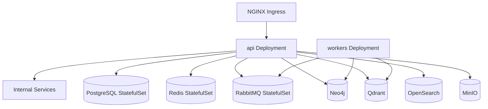

# Kubernetes

Production/staging manifests for the platform.

## Rough topology



## Layout

```
kubernetes/
├── base/
│   ├── namespace.yaml
│   ├── backend/
│   │   ├── api-deployment.yaml
│   │   ├── api-service.yaml
│   │   └── worker-deployment.yaml
│   ├── infrastructure/       # StatefulSets: pg, neo4j, qdrant, os, redis, minio, rmq
│   └── keycloak/
├── overlays/
│   ├── staging/              # kustomize overlay
│   └── production/
└── README.md (this file)
```

## Notes

- Managed by **Kustomize** (declarative), promoted via CD in release workflow.
- Secrets: SealedSecrets; PVCs for persistence.
- HPA added on API + workers once load patterns are measured.

## See

- [DEVOPS_SPEC](../specifications/DEVOPS_SPEC.md)
- [ADR-0010](/docs/architecture/adrs/ADR-0010-kubernetes.md)
